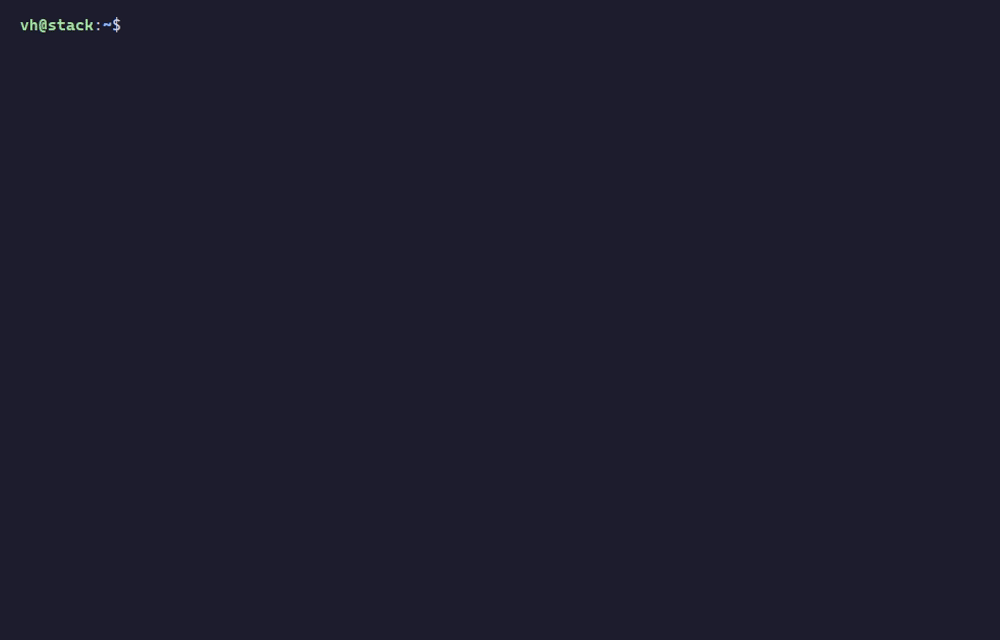

<p align="right">
  <a href="README.md"></a>  
  <a href="README.en.md"></a>  
  <a href="README.ru.md"></a>
</p>

<p align="center">
  <picture>
    <source media="(prefers-color-scheme: dark)" srcset="assets/title-dark.svg">
    <source media="(prefers-color-scheme: light)" srcset="assets/title-light.svg">
    
  </picture>
</p>

# nvimpp, tmuxpp, termpp – your terminal, your code, your style

[](https://github.com/vhstack/vhstack/tags)

[](https://github.com/vhstack/vhstack/actions/workflows/ci.yml)

Hello, I'm **vhstack** 👋

Welcome to my GitHub profile!

Here you'll find my personally curated projects designed to optimize your terminal experience, 
your coding workflow, and your personal style. Unlike many standalone setups you find online, 
these projects are intentionally tuned to complement each other visually, functionally, and 
with a focus on your daily workflow.

## ⚡ Quick Start

On a fresh system, install the packages first:

```bash
sudo apt update
sudo apt install tmux neovim unzip ripgrep clangd
```

Then one command installs the complete working environment (prompt, Tmux,
Neovim) on your server:

```bash
curl -sL https://raw.githubusercontent.com/vhstack/vhstack/main/install.sh | bash
```



See the [installation guide](./INSTALL.en.md) for what the script does in
detail.

Later, one command brings everything up to date:

```bash
vhstack-update
```

## 🔧 My Projects

###  [nvimpp](https://github.com/vhstack/nvimpp)
**Neovim as a C/C++ IDE:**  
clangd, Telescope, Treesitter, Neo-tree and Outline, lazy-loaded and ready in under 100 ms.

###  [tmuxpp](https://github.com/vhstack/tmuxpp)
**tmux that just works:**  
Copy and paste with the mouse straight into the system clipboard, even over SSH via OSC 52. Sensible keys, three themes, no plugin manager.

###  [termpp](https://github.com/vhstack/termpp)
**Terminal, Nerd Font and prompt:**  
Windows Terminal with Catppuccin and Cascadia Code NF. The Oh My Posh prompt shows git status, errors and run time, and true color reaches all the way to the server.

## ✨ About Me

I've spent more time in the terminal than on social media over the years—and I've learned that good software development starts with 
a well-configured environment. With these projects, I aim to help others work efficiently and enjoyably in the terminal, whether 
in the shell or in tools like Neovim.

---

*"The code we write is an expression of ourselves—make it as individual as you are."*

MIT License · [vhstack.github.io](https://vhstack.github.io)
